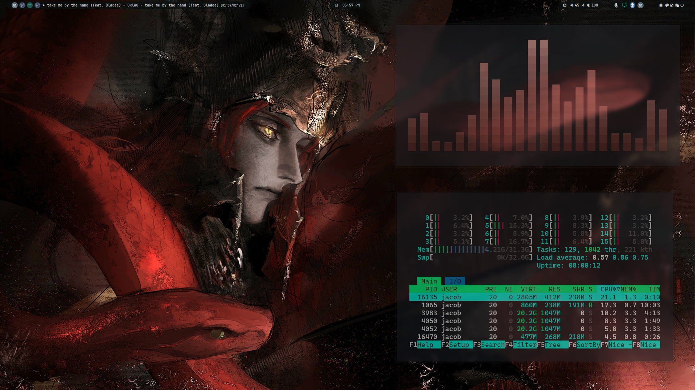
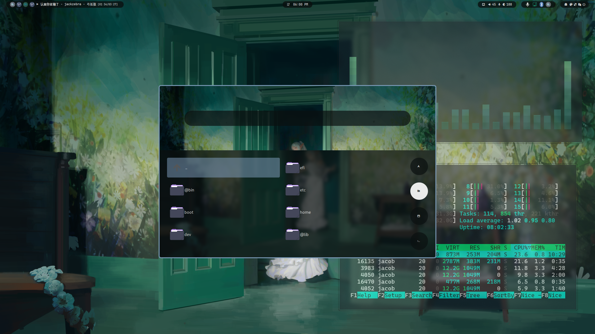
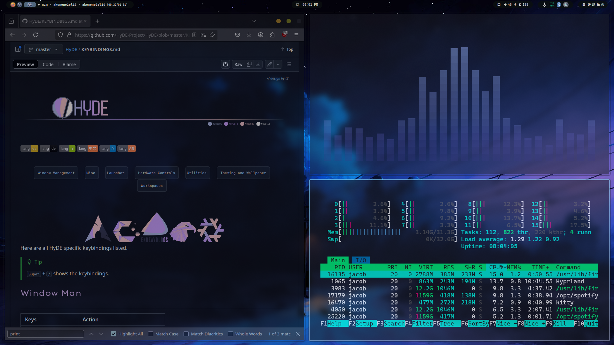

# Code Garden

<div align="center">
    <a href="https://discord.gg/AYbJ9MJez7">
            
    </a>
</div>
<div align="center"><br><br></div>

> **IMPORTANT**
> This is not a standalone theme, it requires [HyDe](https://github.com/Hyde-project/hyde) to be installed.





## Installation

To install **Code Garden** theme, run the following command:

```sh
Hyde theme import "Code Garden" https://github.com/jacobfranco/Code-Garden
```

Alternatively, you can import the theme by running:

```sh
Hyde theme import
```

Then choose Code Garden from the options.

## Tips

Adjusting the transparency of kitty enhances this theme. If you would like some additional transparency. In your kitty.conf:

```
~/.config/kitty/kitty.conf
```

I would add this:

```
background_opacity 0.80
```

I'm partial to the font **Menlo** for the terminal, so you can include that while you're at it. I also use that for VSCode too.

You can get it [here](https://github.com/hbin/top-programming-fonts/tree/master)

I also use the theme **poimandres** for VSCode, which is also available for Neovim and Kitty if that's more your style. I prefer this theming over wallbash, even though wallbash might be better for some wallpapers.

You can get it [here](https://github.com/drcmda/poimandres-theme)
